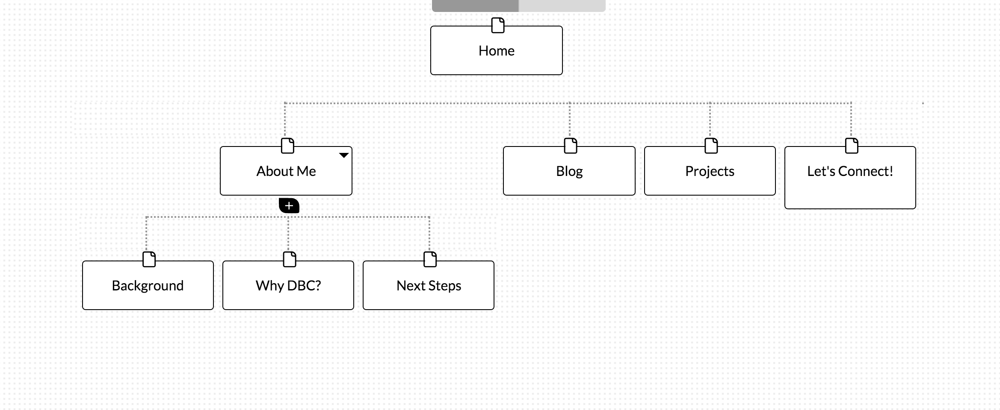

What are the 6 Phases of Web Design? - The six plases of Web Design are: 
	1. Information Gathering - Decide what is the purpose of the web that you are building, and what goals you'd like to accomplish. It's also good to know your target audience, so that you can know which type of group or people you are marketing to. 
	2. Planning - During this phase, you use the information that you have gathered to put together a plan for your web design. During the planning stage is when you create a site map. 
	3. Design - Begin to think about how you'd like for your web site to look. During this phase is a good time to think about the targe audience and how you might appeal the design to that audience. 
	4. Development - Begin to actually create the site. 
	5. Testing and Delivery - Web designer makes edits and tests the site. 
	6. Maintenance - Maintaninence is something that is done over time. After the design of the site is complete, you can also add or update content or products however frequently you'd like. 

What is your site's primary goal or purpose? What kind of content will your site feature? - The primary goal of this site is to share my experience in DBC, as well as display my future projects to an audience, which will primarily be my cohort-mates, as well as job recruiters in the future. 

What is your target audience's interests and how do you see your site addressing them? - I would think that the target audience's interest is primarily in tech. I would think the audience is interested in technology, modernity, and gadgets. As such, I would design a sleek, organized website.

What is the primary "action" the user should take when coming to your site? Do you want them to search for information, contact you, or see your portfolio? It's ok to have several actions at once, or different actions for different kinds of visitors. - The primary action the user should take by coming to my site is finding out more about me, what I do, and the projects that I've worked on. It's important that the website shows a bit about my background, but also about what I'm able to build. I'd like for them to check out my portfolio to see the projects, but also be able to easily find my contact information if they'd like to get in touch. 

What are the main things someone should know about design and user experience? - It's important to know the target audience and the purpose of creating the site. By knowing the purpose you will have a better idea of what to highlight and the layout of the site, and knowing the target audience will help you adjust the content to fit a particular group you are trying to attract or serve.  

What is user experience design and why is it valuable? - User experience design is the process of enhancing the satisfaction of users by improving on the usability pleasure and accesibility that the user will develop by interacting with the product. 

Which parts of the challenge did you find tedious? - The main part of the challenge that I found tedious were a few of the readings. They were interesting and new topics but some of them were a bit repetitive. 
