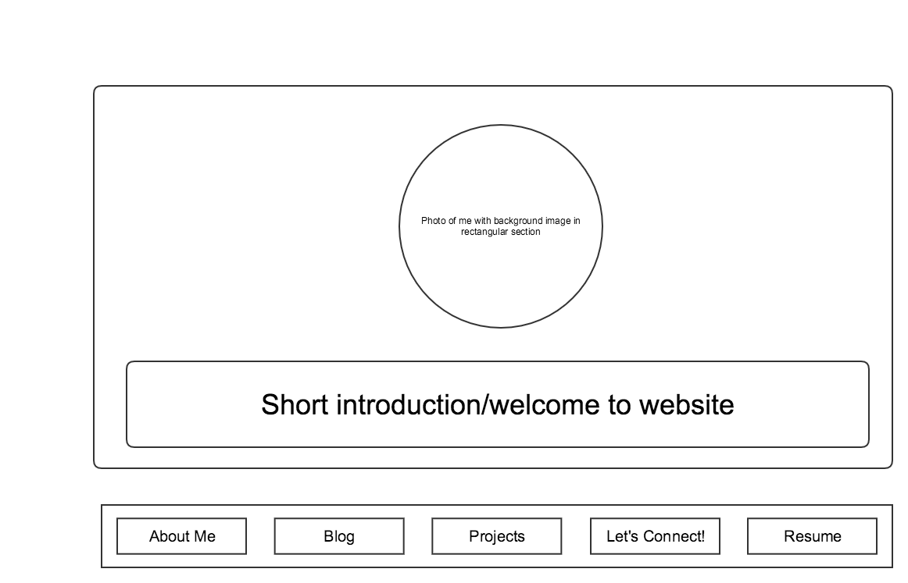

What is a wireframe? - A wireframe can be either a sketch or a digital design that serves as a guide to provide the skeletal framework of the site that you wish to build.

What are the benefits of wireframing? - The benefit of wireframing is that you have a image to reference for the layout of the website. It makes the designing a bit easier because you have a general idea of how you'd like for the website to look. Without a wireframe, it may be more challenging to think of a layout, and you might forget what you'd like to incorporate into the design. Since you do have the layout right in front of you, it's easier to know what code you'll need in order to make the wireframe.  

Did you enjoy wireframing your site? - Wireframing my site was fun. It allowed me to put my ideas down onto a sheet and save them so that I'll have a better idea of how the website will look later. I think wireframing helps me also stick to a layout and gives me a chance to see how a design might look before implementing all of the code. 

Did you revise your wireframe or stick with your first idea? - I revised the wireframing briefly by reordering the content, but the layout is pretty much the same as my first idea. 

What questions did you ask during this challenge? What resources did you find to help you answer them? - The main question I asked was how in depth to go with the design of the wireframe. I knew that I should label each section, but wasn't sure if I should include any photos or background pictures to make it look more like how the site will look. I also researched a lot of examples of different wireframes. I was a bit unsure of how much detail to add, and wanted to make sure it was thorough enough for others to understand but not unnecessary information included. 

Which parts of the challenge did you enjoy and which parts did you find tedious? I really enjoyed fiddling with Gliffy in order to get the wireframing to look, and it was nice to transfer the idea from my head down on paper. It was just a bit time consuming, as I wanted to make sure the layout made sense, was clean and organized, as well as balanced. 