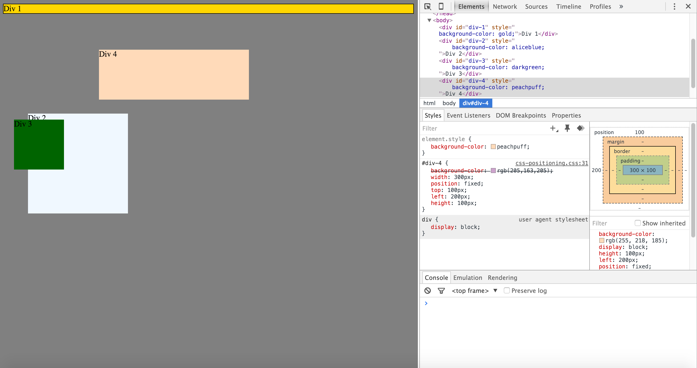
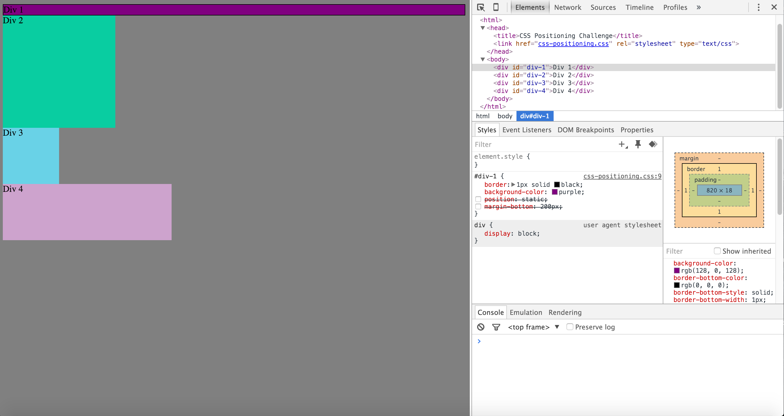
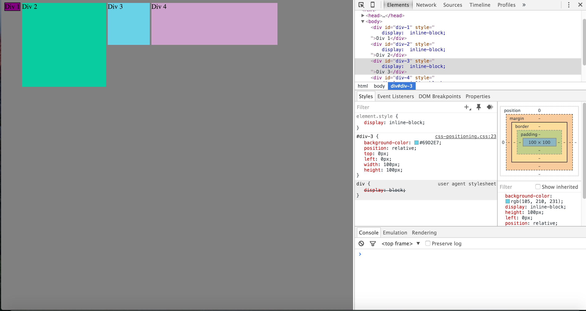
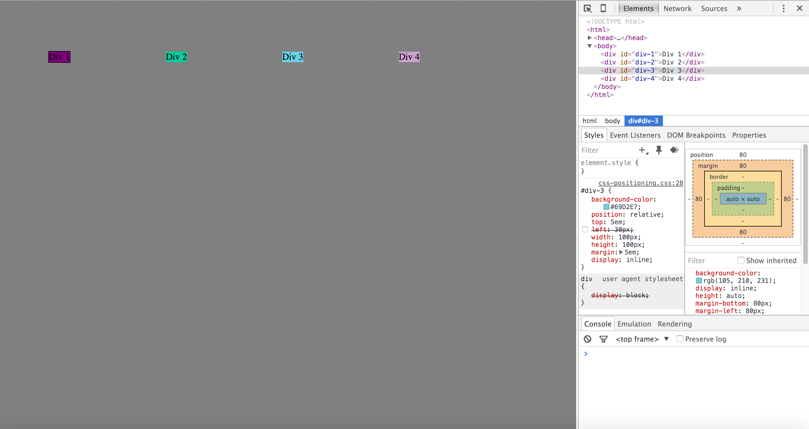
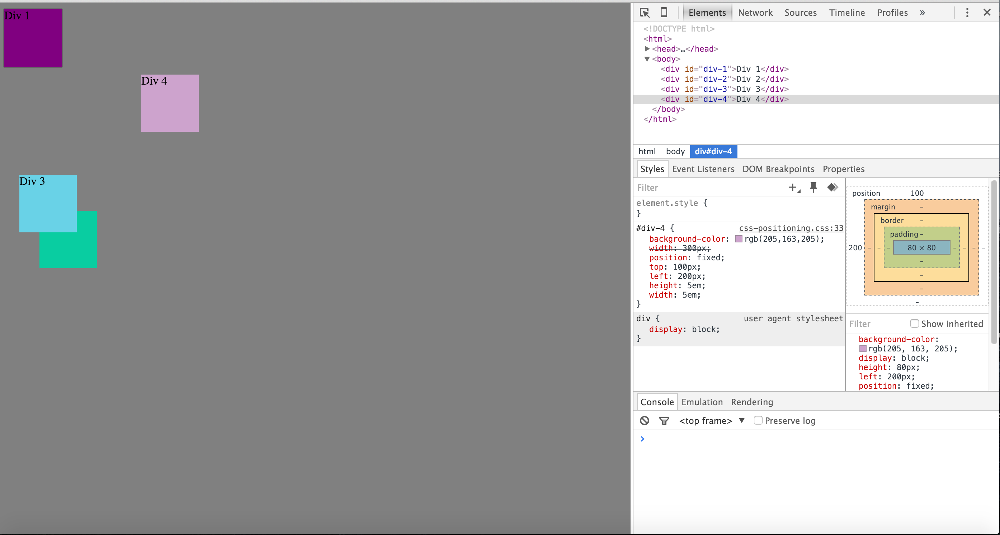
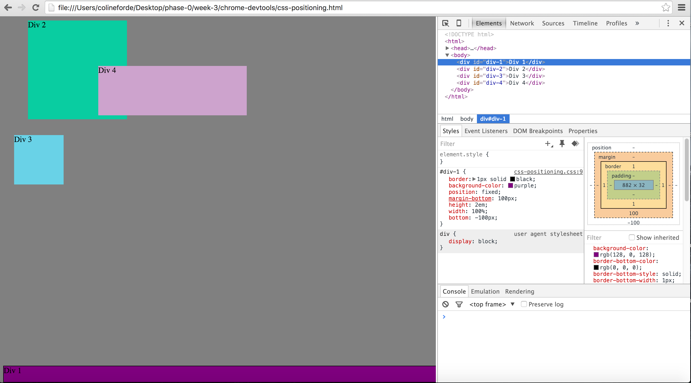
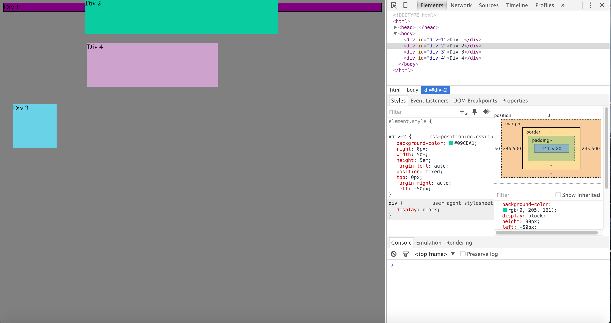
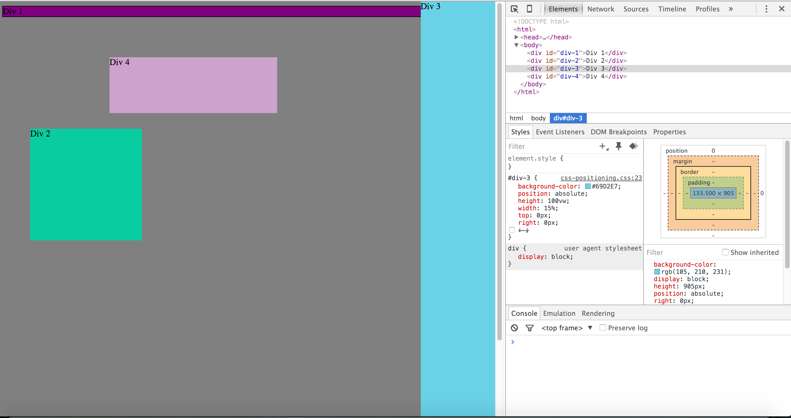
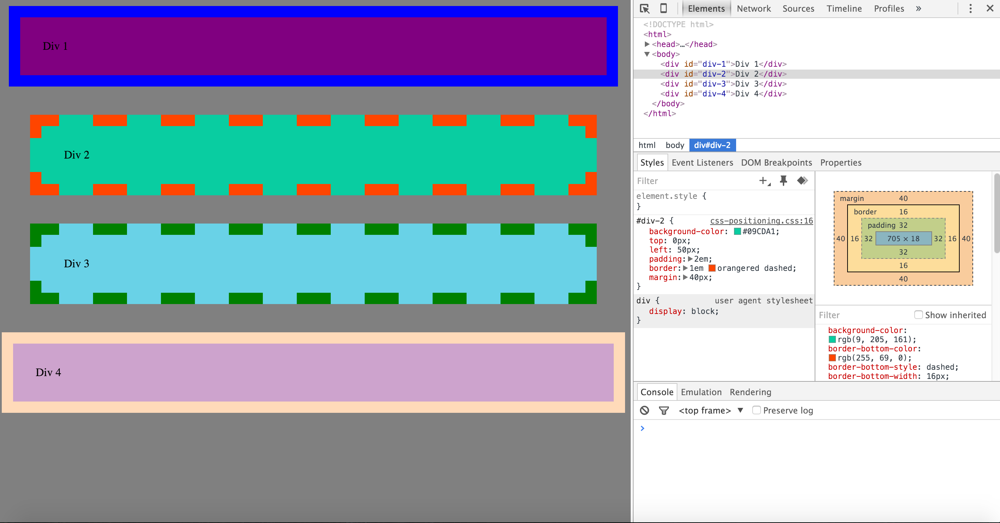

<!-- 

How can you use Chrome's DevTools inspector to help you format or position elements? - You can use DevTools inspector to help you format or position elements because it allows you to 'inspect' the element/ webpage and see the code used for a site. Not only can you see the code but you can also modify the CSS to see how adding/ changing the current formatting changes the layout of elements on the webpage. 

How can you resize elements on the DOM using CSS? - You can resize elements by either using padding on an element (as seen by playing with the padding in this exercise) or by adjusting the width and height of the element.

What are the differences between absolute, fixed, static, and relative positioning? Which did you find easiest to use? Which was most difficult? - Absolute positioning positions the object on the page relative to the nearest positioned ancestor object. Elements with fixed positioning are positioned relative to the browser window size itself. Static positioning is the default positioning for most pages and allows elements to flow onto the page as they normally would. Relative positioning without specifying any pixels causes elements to behave similarly to they would in static, but adding relative positioning to any side of an element shifts the element x amount of space in that direction relative to it's original positioning. I found fixed positioning easiest to use, but found relative to be the most useful when needing to move objects, but also took a bit of time to understand how adding pixels to any side would affect the positining, which made it to be a bit challenging initialy.   

What are the differences between margin, border, and padding? - The margin is the space outside of the elements, the border is the space at the edge of each element and the padding is the space between that appears around each element. 

What was your impression of this challenge overall? (love, hate, and why?) - I really liked this challenge! I think it was a great chance to see how we can manipulate the different CSS formatting, and it gave me a better feel of what each formatting tag does. I think I'll need a bit more practice to truly understand the ins and outs of them all, but this was a great way to get my feet wet in a non time-consuming exercise!  

--!>
