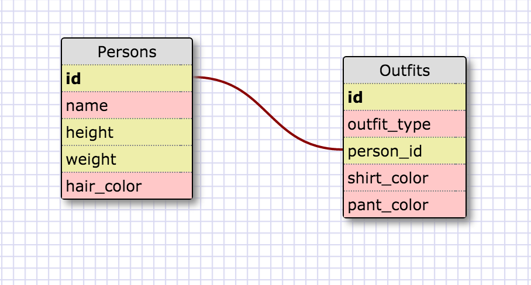

1. SELECT * FROM states;
2. SELECT * FROM regions; 
3. SELECT state_name, population FROM states; 
4. SELECT state_name, population FROM states ORDER BY population desc;
5. SELECT state_name FROM states WHERE region_id = 7;
6. SELECT state_name, population_density FROM states WHERE population_density > 50 ORDER BY population_density asc;
7. SELECT state_name FROM states WHERE population > 1000000 AND population < 1500000;
8. SELECT state_name, region_id FROM states ORDER BY region_id asc;
9. SELECT region_name FROM regions WHERE region_name LIKE "%Central%";
10. SELECT region_name, state_name FROM states INNER JOIN regions ON region_id = regions.id ORDER BY region_id; 




```
What are databases for? - Databases are places to store data in a stuctured way using columns so that you may easily access/ search data stored in the tables. 
What is a one-to-many relationship? - A one-to-many relationship is one that a datatype can include more than one object. An example of this used in the exercise is that regions and states have a one to many relationship as one region has many states. 
What is a primary key? What is a foreign key? How can you determine which is which?
How can you select information out of a SQL database? What are some general guidelines for that?
```