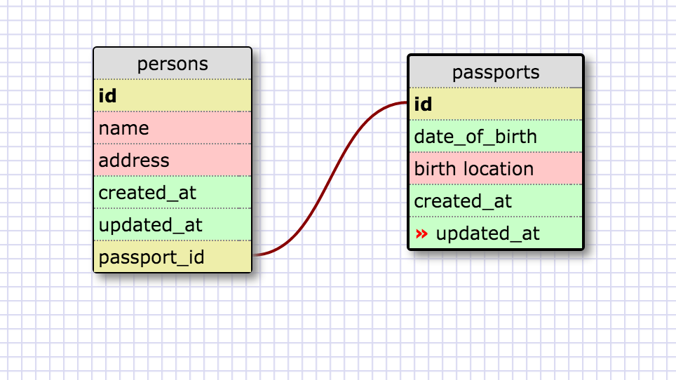
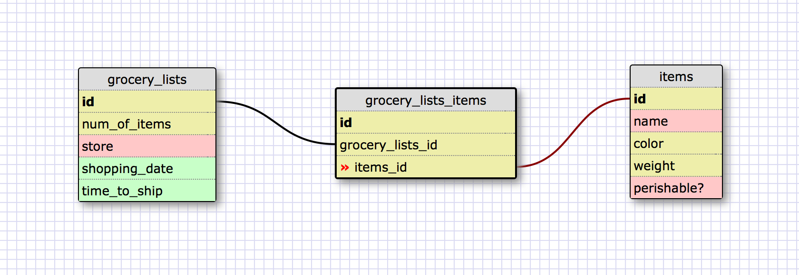

This is a one-to-one relationship because a person can have one passport, and a passport can only belong to one person. It is also a one-to-one relationship because it's possible for the passport_id to be null if the person does not have a passport. 





```
Reflection 

What is a one-to-one database? - A one-to-one database is when two items have a single relationship to one another. With a one-to-one relationship, one of the groups of fields can optionally be null. 
When would you use a one-to-one database? (Think generally, not in terms of the example you created). - You would use a one-to-one relationship when a pair of items only belong to the other pair, and don't have multiple relationships. 
What is a many-to-many database? - A many-to-many relationship is when both items in a pair have more than one relationship. An example of this would be events in a tournament, and competitors. A competitor can have many events, and an event can have many participants.  
When would you use a many-to-many database? (Think generally, not in terms of the example you created). - You would use a many-to-many if you'd like to store information from two different categories that both belong to more than one of the linked table. 
What is confusing about database schemas? What makes sense? - I get the concept and can think of examples of when to use which schema, but it's a bit confusing when actually thinking of examples of either, and what fields I'd put for each. 

```
